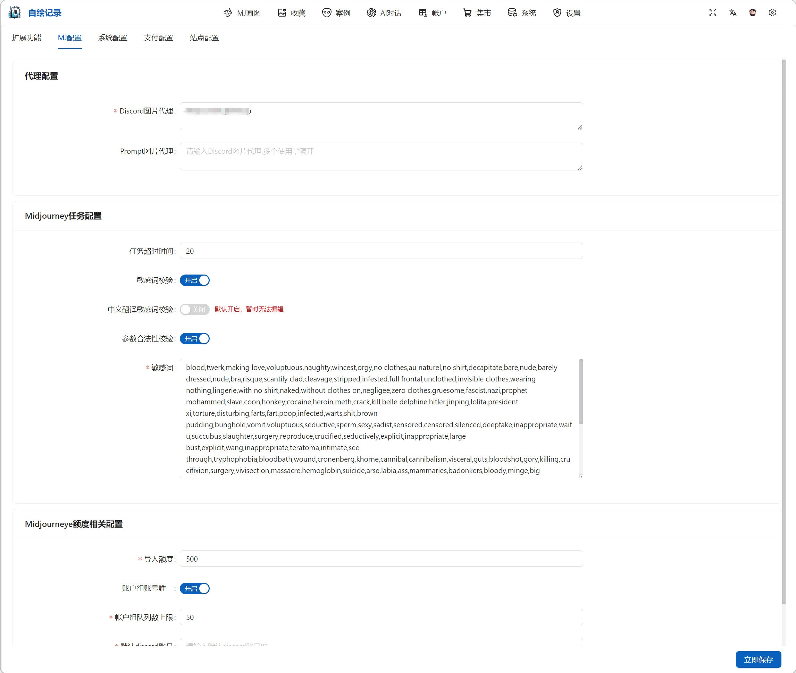

# midjourney旅行者

地表最佳！一键部署属于你自己的 Midjourney 前后端服务。精细化的图片查看以及管理，告别Discord 的困难找图。


## 体验地址

[体验地址](https://midjourneyers.com)

## 功能列表

#### midjourney 功能

- [X]  `NIJI`机器人/`Midjourney`机器人
- [X]  `Imagine`
- [X]  `Blend`
- [X]  `Describe`& 自动垫图
- [X]  `U/V` 操作
- [X]  `ZOOM` & `Custom zoom`
- [X]  `UPSCALE `& `UPSCALE 2X` & `UPSCALE 4X`
- [X]  `VARIATION` 系列操作
- [X]  `REMIX`
- [X]  `PAN` 系列操作
- [X]  局部重绘
- [X]  `Turbo` & `Fast` & `Relax`
- [X]  V6操作 & `Upscale (Subtle)` & `Upscale (Creative)`
- [X]  ... 作图功能全集成，自己体验把！

#### 扩展功能

- [X]  Discord历史消息导入
- [X]  批量跑图（一晚上400 + relax 不是梦）
- [X]  自动分割4图
- [X]  内嵌翻译
- [X]  内嵌AI生成提示词
- [X]  内嵌3000+提示词
- [X]  工作空间管理
- [X]  图片打标签
- [X]  收藏分类
- [X]  Discord 授权码共享账号
- [X]  Discord 多账号管理 & 账号组管理 & Chatgpt账号管理
- [X]  基于非公平算法分配批量用户任务，特定类型任务优先
- [X]  保护账号机制
- [X]  系统相关参数配置页面集成
- [X]  部分页面UI升级
- [X]  ... 各种其他小功能，写的累，自己看吧 =_=!

#### 1月版本待开发

* [ ]  Midjourney画廊引入（开发中）
* [X]  参数配置UI（已完成）
* [ ]  UI优化（进行中）
* [ ]  问题修复（进行中）
* [ ]  专注模式
* [ ]  收藏分享

## 项目部署

### 1.前置环境准备

* [ ]  一个"墙外"VPS
* [ ]  Pandora-next搭建（免费的Chatgpt逆向，[项目地址](https://github.com/pandora-next/deploy))）
* [ ]  Redis
* [ ]  Mysql 8.0
* [ ]  根目录初始化sql执行

### 2.Docker服务部署

#### 方式一：前后端一键部署(Docker Compose)

```
version: '3.8'

services:
  gfishUI:
    image: gfishfont/gfish-ui:latest
    environment:
      - VG_BASE_URL={后端接口地址}
      - VG_APP_TITLE={网站名称}
    ports:
      - "8081:80"

  gfishApi:
    image: gfishauth/auth_free:latest
    container_name: gfish-api
    ports:
      - "7099:7099"
    environment:
      - TZ=Asia/Shanghai
      - SERVER_PORT=7099
      - SPRING_APPLICATION_NAME=dfish
      - DISCORD_PROXY_SWITCH_FLAG=false
      - SPRING_PROFILES_ACTIVE=prod
      - SPRING_DATASOURCE_URL=jdbc:mysql://{数据库地址:端口}/{数据库名}?useUnicode=true&characterEncoding=UTF-8&serverTimezone=Asia/Shanghai
      - SPRING_DATASOURCE_USERNAME={账号}
      - SPRING_DATASOURCE_PASSWORD={密码}
      - SPRING_REDIS_HOST={redis地址}
      - SPRING_REDIS_PORT={redis端口}
      - SPRING_REDIS_DATABASE=0
      - SPRING_REDIS_PASSWORD={redis密码}
      - RUN_MODE=single
    healthcheck:
      test: ["CMD", "curl", "-f", "http://localhost:7099/actuator/health"]
      interval: 1m
      timeout: 10s
      retries: 3
```

#### 方式二：分离部署(Docker Compose)

##### 前端单独部署(Docker Compose)

```dockerfile
version: '3.8'

services:
  gfishUI:
    image: gfishfont/gfish-ui:latest
    environment:
      - TZ=Asia/Shanghai
      - VG_BASE_URL={后端接口地址}
    ports:
      - "8081:80"
```

##### 后端单独部署(Docker Compose）

```dockerfile
version: '3'

services:
  # 服务名称，替换成你的实际服务名称
  gfishApi:
    # Docker镜像名称和标签，替换成你的实际镜像名称和标签
    image: gfishauth/auth_free:latest
    # 容器名称，替换成你的实际容器名称
    container_name: gfish-api
    # 端口映射，根据需要进行调整
    ports:
      - "7099:7099"
    # 环境变量设置
    environment:
      - TZ=Asia/Shanghai
      # 服务器端口
      - SERVER_PORT=7099
      # Spring应用名称
      - SPRING_APPLICATION_NAME=dfish
      # Spring活动配置
      - SPRING_PROFILES_ACTIVE=prod
      # 关闭本地代理
      - DISCORD_PROXY_SWITCH_FLAG=false
      # MySQL 配置
      -e SPRING_DATASOURCE_URL=jdbc:mysql://{{数据库地址:端口}}/{数据库名}?useUnicode=true&characterEncoding=UTF-8&serverTimezone=Asia/Shanghai
      -e SPRING_DATASOURCE_USERNAME={账号}
      -e SPRING_DATASOURCE_PASSWORD={密码}

      # Redis 配置
      -e SPRING_REDIS_HOST={redis地址}
      -e SPRING_REDIS_PORT={redis端口}
      -e SPRING_REDIS_DATABASE=0
      -e SPRING_REDIS_PASSWORD={redis密码}

      # 运行模式：single
      - RUN_MODE=single

    # 健康检查
    healthcheck:
      test: ["CMD", "curl", "-f", "http://localhost:7099/actuator/health"]
      interval: 1m
      timeout: 10s
      retries: 3
```

### 3.Nginx配置反向代理

> 这个没啥好说的，晚上一搜就出来了。

### 4.基础配置相关

#### 默认账号配置 ( `df_user` 表随便改)

> **管理员账号**：admin@admin.com
>
> **管理员密码**：aa123456

#### Prompt提示词风格数据

[图片数据](https://github.com/gfish007/midjourney-prompt-image) 可以自己上传到OSS，或者直接使用 github 图床。数据在表：`df_robot_prompt `。这里面有个 `rewrite_image_url`字段，如果未配置连接代理的话（`df_dict`表里的`Promtp图片代理`配置项），将使用 rewrite_image_url 的连接。

[github图床地址测试](https://gfish007.github.io/midjourney-prompt-image/mj/dongman/fp15ph1bjlmaz2g9.png)

#### 自定义菜单

当前未开发菜单集成页面，如果需要请至 `Mysql` 的 `sys_menu` 表添加相关配置页面。

#### 扩展功能配置

管理员账号登录配置



## 免费版本限制说明（暂定限制如下，具体数值待定，默认都是1）

- 只开放 single 模式（单机直跑）
- Discord 账号个数限制
- 账户组内账户个数
- 账户组个数限制
- 生成授权码个数限制
- Chatgpt账号个数限制
- 提交任务数上限限制

## 部分截图

### PC端：


### 移动端：


## 问题 & 联系方式

### QQ


### 微信


