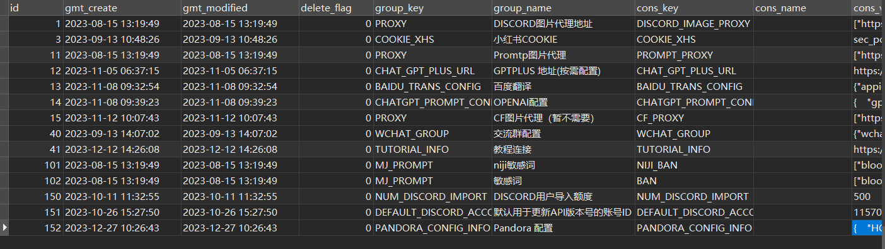
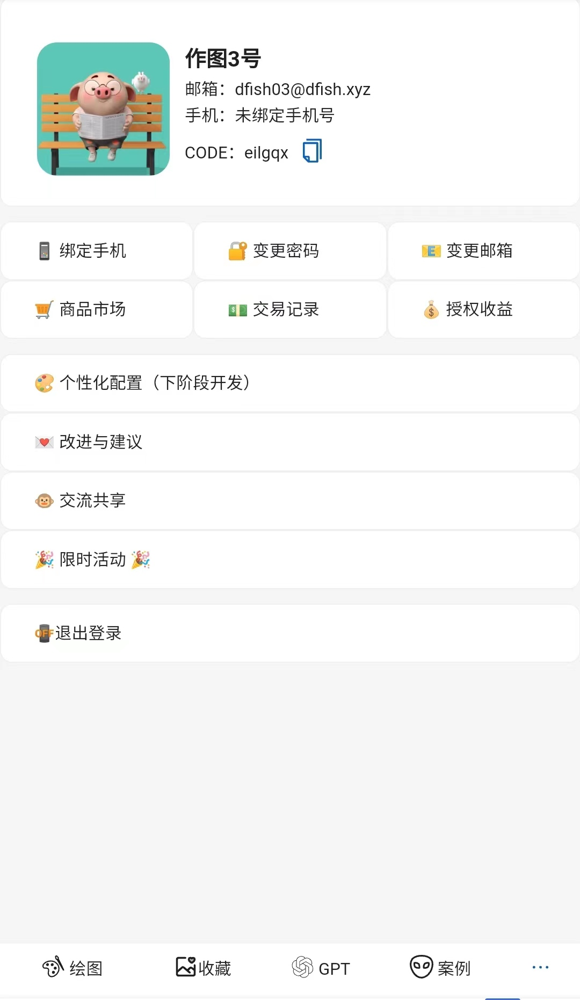

# gfish

免费 Midjourney 代理 + UI 前后端一键部署

## 体验地址

[体验地址](https://demo.gfish.top) 

## 功能列表

#### midjourney 功能

- [X]  NIJI机器人/Midjourney机器人
- [X]  Imagine
- [X]  Blend
- [X]  Describe & Describe后的自动垫图
- [X]  ZOOM/Custom zoom
- [X]  UPSCALE/UPSCALE 2X、UPSCALE 4X
- [X]  VARIATION
- [X]  REMIX
- [X]  PAN
- [X]  局部重绘
- [X]  Turbo/Fast/Relax
- [X]  ... 作图功能全集成，自己体验把！

#### 扩展功能

- [X]  Discord历史消息导入
- [X]  批量跑图（一晚上400 + relax 不是梦）
- [X]  自动分割4图
- [X]  内嵌翻译
- [X]  内嵌AI生成提示词
- [X]  内嵌3000+提示词
- [X]  提供工作空间管理图片
- [X]  图片打标签
- [X]  收藏分类
- [X]  Discord 授权码共享账号
- [X]  Discord 多账号管理 & 账号组管理 & Chatgpt账号管理
- [X]  基于非公平算法分配批量用户任务，特定类型任务优先
- [X]  无任务处理，自动关闭socket，保护账号
- [X]  ... 各种其他小功能，写的累，自己看吧 =_=!

#### 待开发

* [ ]  Midjourney画廊引入
* [ ]  Midjourney参数配置UI
* [ ]  系统相关参数配置页面
* [ ]  专注模式
* [ ]  收藏分享

## 项目部署

### 前置环境准备

* [ ]  一个"墙外"VPS
* [ ]  Pandora-next搭建（免费的Chatgpt逆向，[项目地址](https://github.com/pandora-next/deploy))）
* [ ]  Redis
* [ ]  Mysql 8.0
* [ ]  根目录初始化sql执行

### 前后端一键部署

#### 方式一：Docker Compose

```
version: '3.8'

services:
  gfishUI:
    image: gfishfont/gfish-ui:latest
    environment:
      - VG_BASE_URL={后端接口地址}
      - VG_DEFAULT_USER={初始账户}
      - VG_DEFAULT_PASSWORD={初始密码}
    ports:
      - "8081:80"

  gfishApi:
    image: gfishauth/auth_free:latest
    container_name: gfish-api
    ports:
      - "7099:7099"
    environment:
      - SERVER_PORT=7099
      - SPRING_APPLICATION_NAME=dfish
      - SPRING_PROFILES_ACTIVE=prod
      - SPRING_DATASOURCE_URL=jdbc:mysql://{数据库地址:端口}/{数据库名}?useUnicode=true&characterEncoding=UTF-8&serverTimezone=Asia/Shanghai
      - SPRING_DATASOURCE_USERNAME={账号}
      - SPRING_DATASOURCE_PASSWORD={密码}
      - SPRING_REDIS_HOST={redis地址}
      - SPRING_REDIS_PORT={redis端口}
      - SPRING_REDIS_DATABASE=0
      - SPRING_REDIS_PASSWORD={redis密码}
      - MAIL_HOST={邮箱HOST}
      - MAIL_PORT={发信PORT}
      - MAIL_USERNAME={账号}
      - MAIL_PASSWORD={密码}
      - RUN_MODE=single
    healthcheck:
      test: ["CMD", "curl", "-f", "http://localhost:7099/actuator/health"]
      interval: 1m
      timeout: 10s
      retries: 3
```

### 前端单独部署

#### **方式一：Docker**

```
docker run -p 8080:80 -e VG_SUB_DOMAIN="{后端地址}" -e VG_DEFAULT_USER="{默认用户}" -e VG_DEFAULT_PASSWORD="{默认密码}" gfishfont/gfish-ui:latest
```

#### **方式二：Docker Compose**

```dockerfile
version: '3.8'

services:
  gfishUI:
    image: gfishfont/gfish-ui:latest
    environment:
      - VG_BASE_URL={后端接口地址}
      - VG_DEFAULT_USER={初始账户}
      - VG_DEFAULT_PASSWORD={初始密码}
    ports:
      - "8081:80"
```

### 后端单独部署

#### 方式一：Docker

```
docker run -d \
--name gfish-api \
-p 7099:7099 \
-e SPRING_PROFILES_ACTIVE=prod \
# MySql 配置
-e SPRING_DATASOURCE_URL=jdbc:mysql://{数据库地址:端口}/{数据库名}?useUnicode=true&characterEncoding=UTF-8&serverTimezone=Asia/Shanghai \
-e SPRING_DATASOURCE_USERNAME={账号} \
-e SPRING_DATASOURCE_PASSWORD={密码} \
# Redis 配置
-e SPRING_REDIS_HOST={redis地址} \
-e SPRING_REDIS_PORT={redis端口} \
-e SPRING_REDIS_DATABASE=0 \
-e SPRING_REDIS_PASSWORD={redis密码} \
# 邮件配置
- MAIL_HOST={邮箱HOST}
- MAIL_PORT={邮箱发信端口}
- MAIL_USERNAME={用户名}
- MAIL_PASSWORD={密码}
gfishauth/auth_free:latest
```

#### 方式二：Docker Compose

```dockerfile
version: '3'

services:
  # 服务名称，替换成你的实际服务名称
  gfishApi:
    # Docker镜像名称和标签，替换成你的实际镜像名称和标签
    image: gfishauth/auth_free:latest
    # 容器名称，替换成你的实际容器名称
    container_name: gfish-api
    # 端口映射，根据需要进行调整
    ports:
      - "7099:7099"
    # 环境变量设置
    environment:
      # 服务器端口
      - SERVER_PORT=7099
      # Spring应用名称
      - SPRING_APPLICATION_NAME=dfish
      # Spring活动配置
      - SPRING_PROFILES_ACTIVE=prod

      # MySQL 配置
      -e SPRING_DATASOURCE_URL=jdbc:mysql://{{数据库地址:端口}}/{数据库名}?useUnicode=true&characterEncoding=UTF-8&serverTimezone=Asia/Shanghai
      -e SPRING_DATASOURCE_USERNAME={账号}
      -e SPRING_DATASOURCE_PASSWORD={密码}

      # Redis 配置
      -e SPRING_REDIS_HOST={redis地址}
      -e SPRING_REDIS_PORT={redis端口}
      -e SPRING_REDIS_DATABASE=0
      -e SPRING_REDIS_PASSWORD={redis密码}

      # 邮件配置
      - MAIL_HOST={邮箱HOST}
      - MAIL_PORT={发信PORT}
      - MAIL_USERNAME={账号}
      - MAIL_PASSWORD={密码}

      # 运行模式：single
      - RUN_MODE=single

    # 健康检查
    healthcheck:
      test: ["CMD", "curl", "-f", "http://localhost:7099/actuator/health"]
      interval: 1m
      timeout: 10s
      retries: 3
```

### 基础配置相关

#### 默认账号配置

> **管理员账号**：admin
>
> **管理员密码**：admin123456

#### 自定义菜单

当前未开发菜单集成页面，如果需要请至 `Mysql` 的 `sys_menu` 表添加相关配置页面。

#### 扩展功能配置

当前未开发页面，请至 `Mysql` 的 `df_dict` 表修改相关值



## 免费版本限制说明（暂定限制如下，具体数值待定）

- 只开放 single 模式（单机直跑）
- Discord 账号个数限制
- 账户组内账户个数
- 账户组个数限制
- 生成授权码个数限制
- Chatgpt账号个数限制
- 提交任务数上限限制

## 部分截图

### PC端：


### 移动端：




## 问题 & 联系方式

### QQ


### 微信


